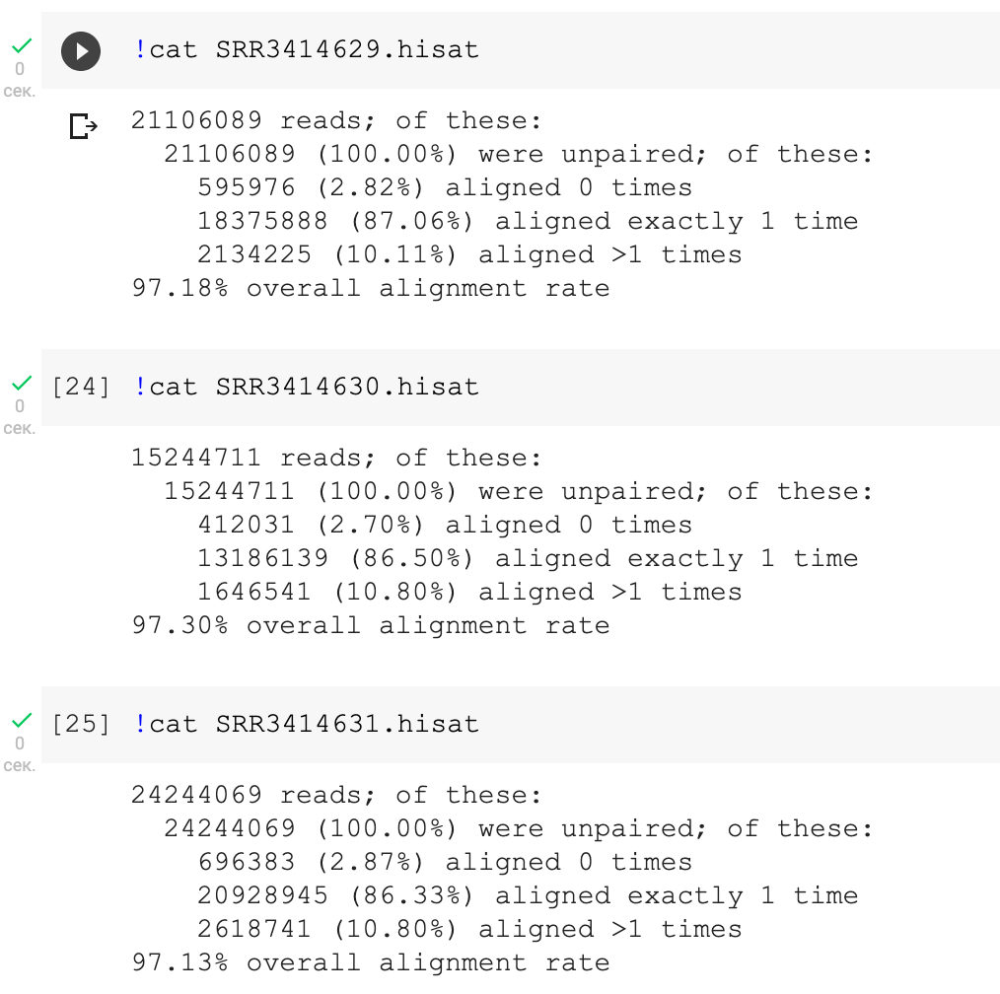
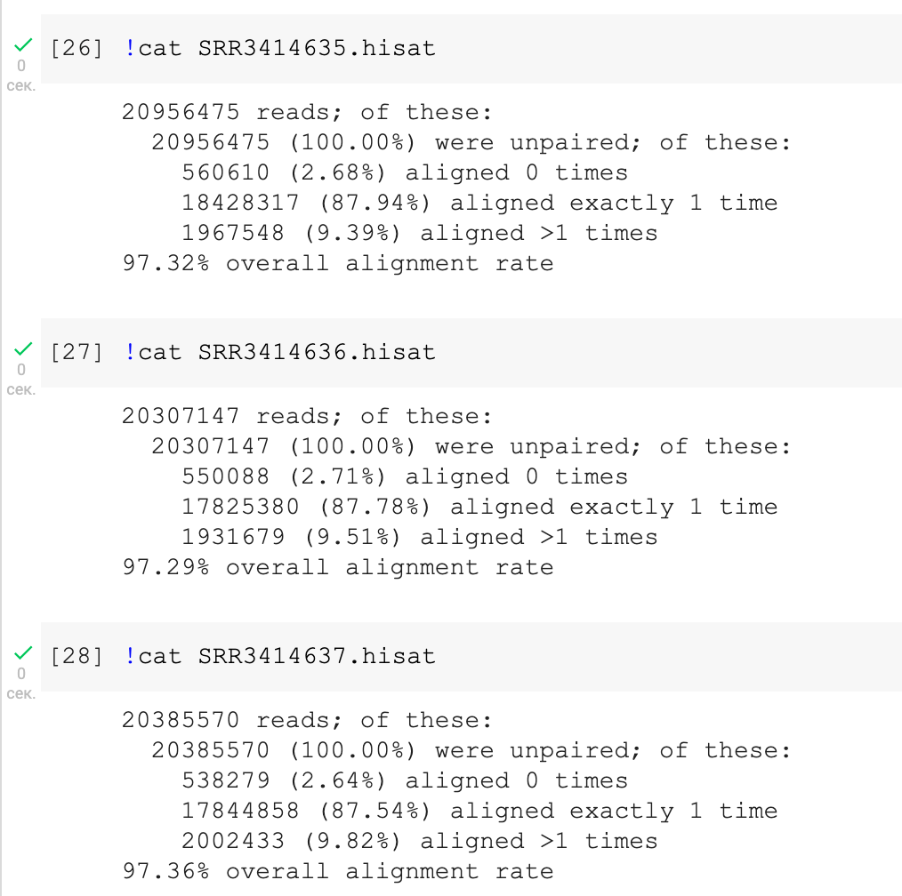
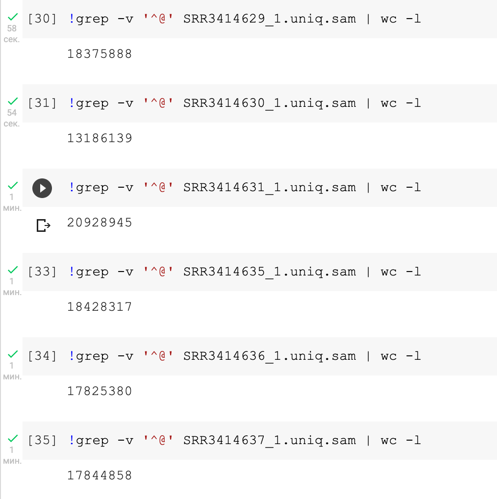
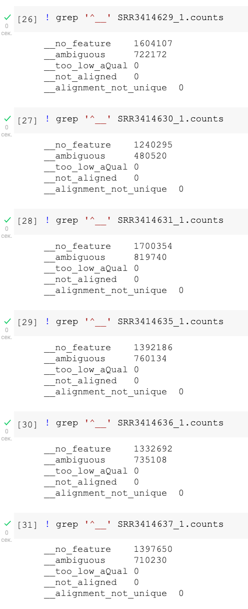
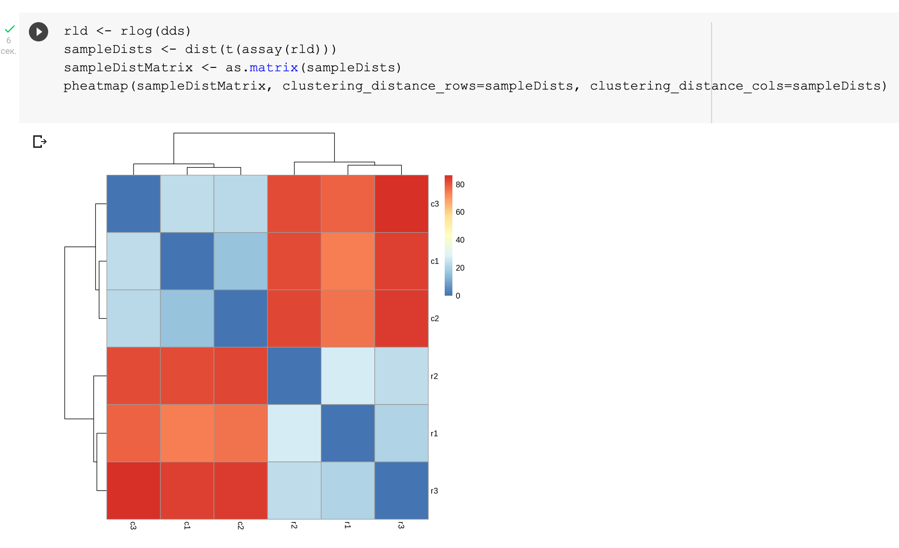
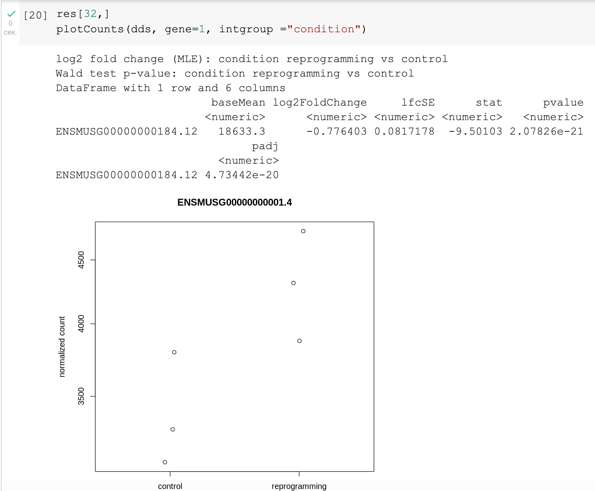
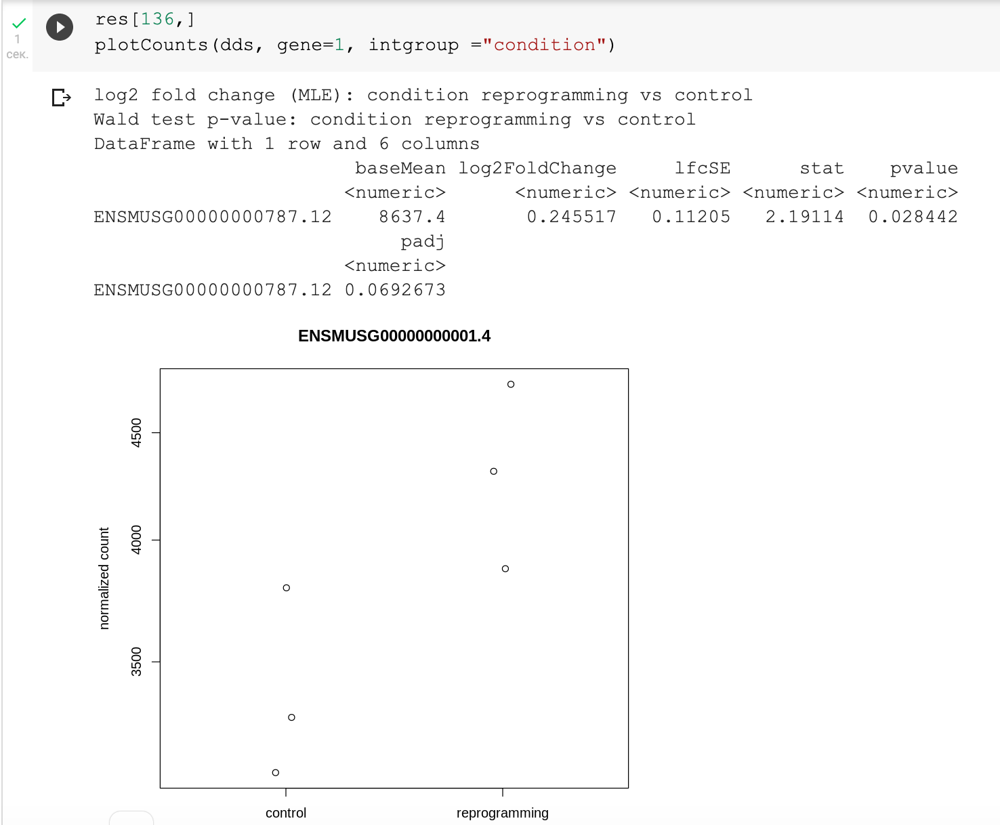
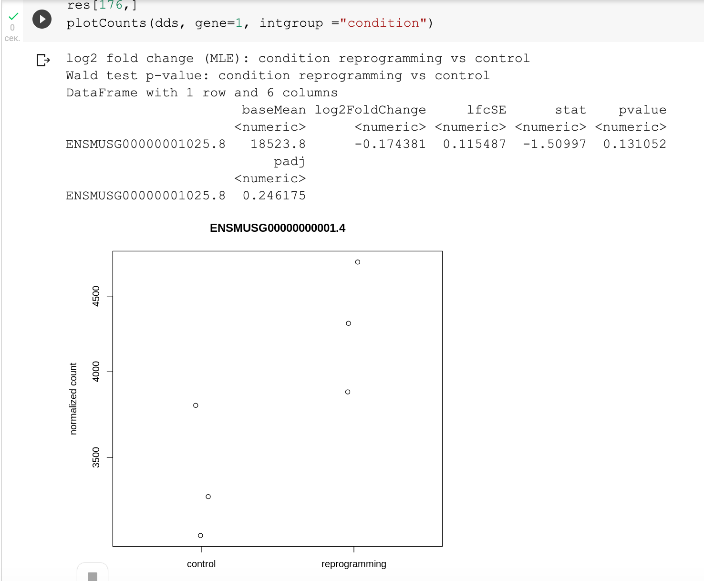
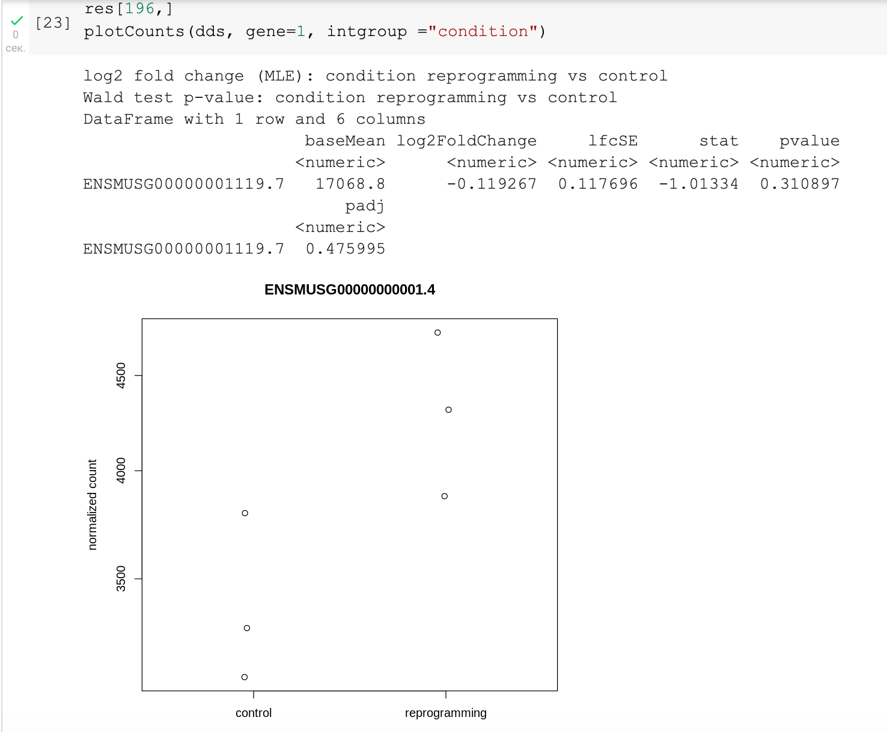

# Описание ДЗ-2

## Часть 1

Ноутбук: https://colab.research.google.com/drive/1RzW_YFp6mEfdQ_Kk2CbUejCdpGzAyoMB?usp=sharing

Статистика из HISAT:

Количество уникальных ридов:

Статистика из HTSEQ

## Часть 2

Ноутбук: https://colab.research.google.com/drive/1lv8SwvlkNMXaGaERPEVKa2KqRD2J_ldo?usp=sharing

plotMA:

Heat Map:

Графики Normalized counts для генов, которые сильнее всего поменяли экспрессию:

