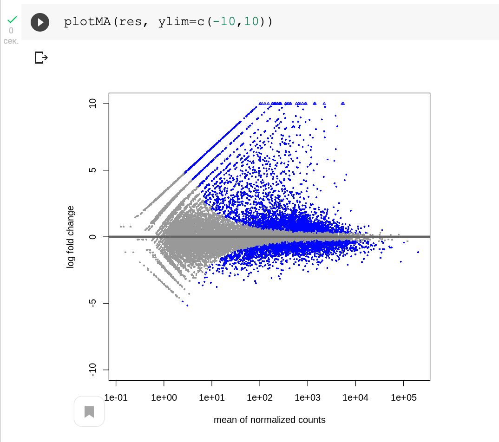

# Описание ДЗ-2

## Часть 1

Ноутбук: https://colab.research.google.com/drive/1RzW_YFp6mEfdQ_Kk2CbUejCdpGzAyoMB#scrollTo=FNDsGQf1ya1y

Статистика из HISAT:

Количество уникальных ридов:

Статистика из HTSEQ

<!--  -->

## Часть 2

Ноутбук: https://colab.research.google.com/drive/1lv8SwvlkNMXaGaERPEVKa2KqRD2J_ldo#scrollTo=_2-uqlZR_yqq

plotMA:

Heat Map:
<!--  -->

Графики Normalized counts для генов, которые сильнее всего поменяли экспрессию:

